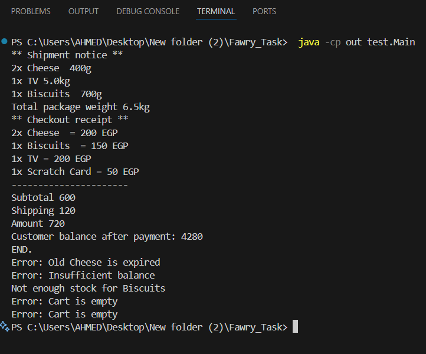

Fawry Shopping Cart (Java)
========================

Overview
--------
This is a simple, extensible Java implementation of a shopping cart and checkout system, inspired by real-world e-commerce. The system supports multiple product types (expirable, non-expirable, shippable, non-shippable), customer accounts, and a checkout process with error handling. The design is modular and easy to extend for new product types or business rules.

Features
--------
- Supports expirable and non-expirable products
  - Expirable products: Can be marked as expired
  - Non-expirable products: Never expire
- Shippable and non-shippable product support
- Add products to a cart and perform checkout
- Handles errors such as:
  - Expired products
  - Insufficient stock
  - Insufficient customer balance
  - Empty cart
- Prints detailed shipment and checkout receipts
- Easily extensible for new product types or rules

Files
-----
- `Product.java`             : Abstract base class for all products
- `ExpirableProduct.java`    : Abstract class for products that can expire
- `NonExpirableProduct.java` : Abstract class for products that never expire
- `Cheese.java`              : Example expirable, shippable product
- `Biscuits.java`            : Example expirable, shippable product
- `TV.java`                  : Example non-expirable, shippable product
- `MobileScratchCard.java`   : Example non-expirable, non-shippable product
- `Cart.java`                : Manages cart items and operations
- `CartItem.java`            : Represents a product and quantity in the cart
- `Customer.java`            : Represents a customer with a balance
- `CheckoutService.java`     : Handles the checkout process and error handling
- `ShippingService.java`     : Handles shipment logic and output
- `Main.java`                : Test class demonstrating all features (in `src/test/`)

How to Compile
--------------
Open a terminal in the project root directory and run:

    javac -d out src/model/*.java src/service/*.java src/test/Main.java

How to Run
----------
After compiling, run the test class:

    java -cp out test.Main

Example Output
--------------
    ** Shipment notice **
        2x Cheese  400g
        1x TV 5.0kg
        1x Biscuits  700g
        Total package weight 6.5kg
    ** Checkout receipt **
        2x Cheese  = 200 EGP
        1x Biscuits  = 150 EGP
        1x TV = 200 EGP
        1x Scratch Card = 50 EGP
        ----------------------
        Subtotal 600
        Shipping 120
        Amount 720
        Customer balance after payment: 4280
        END.
        Error: Old Cheese is expired
        Error: Insufficient balance
        Not enough stock for Biscuits
        Error: Cart is empty
        Error: Cart is empty

Customization
-------------
To add new product types, simply extend the `Product` class (or one of its subclasses) and update the logic in the relevant services if needed. The system is designed for easy extension and modification.

